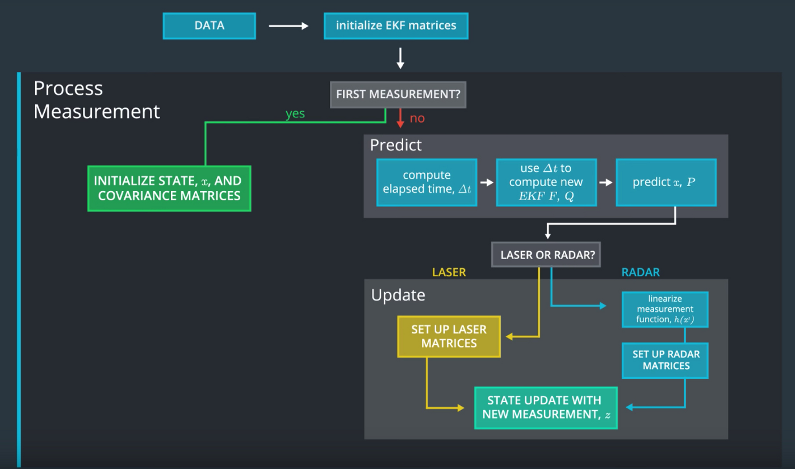
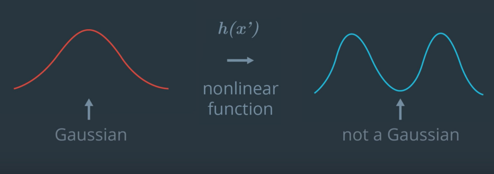
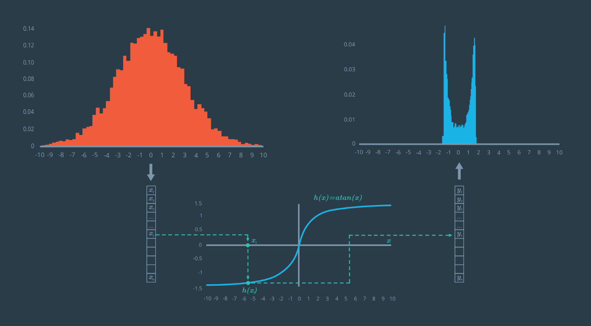

# Kalman Filters
## Task Description
The task is to track a car using LIDAR and RADAR sensors. Each of the sensors has its strengths and weaknesses. We will use Kalman Filter to fuse data from both.

Our sensor team did all necessary filtering and tracking of LIDAR point clouds and RADAR data, and provides us with $[x, y]^T$ position from LIDAR and $[\rho, \phi, \dot \rho]^T$ data from RADAR.

### LIDAR
**LI**ght **D**etection **A**nd **R**anging - sensor that emits laser rays and returns a point cloud with distances. [This video](https://www.youtube.com/watch?v=EYbhNSUnIdU) explains how LIDAR works. 

In our case we assume we have detected objects in a scene and represened each with a bounding box, ID, and estimated location. How will it look like? Check [this video](https://www.youtube.com/watch?v=si9gamz07LA&t=88s).

For simplicity we assume only one object - car we want to track. So, data from LIDAR will have the form:

$y_L = \begin{bmatrix} p_x \\ p_y\end{bmatrix}$

### RADAR
**RA**dio **D**etection **A**nd **R**anging - sensor that uses Dopler effect to measure velocity and position. The ability of RADAR to independently measure velocity is very important for us. Also, RADARs perform better than LIRARs in bad weather conditions. [This video](https://www.youtube.com/watch?v=ywDE57CtaTM) explains how RADAR works.

The only problem is RADAR returns its data in Polar form, and we will need to convert it into Cartesian system. 

So, data from RADAR will have the form:

$y_R = \begin{bmatrix} \rho \\ \phi \\ \dot \rho\end{bmatrix}$

### Our pipeline
Here is a quick overview of the Kalman filter we will build. 

## Math

### System
We have a discrete linear system of the following form:

$\begin{cases}x_{i+1} = Ax_{i} + Bu_{i} + w \\ y_{i} = Cx_{i} + v\end{cases}$

where:
$x_{i}$ - state vector of the system at time $i$ \
$u_{i}$ - input(also called control) vector at time $i$ \
$y_{i}$ - output vector at time $i$. Usually represents quantities we can measure \
$A$ - state transition matrix. How $x$ evolves over time\
$B$ - input matrix. Represents how $u_{i}$ influences on $x_{i}$ \
$C$ - output matrix(also called measurement matrix). Represesents the relation between $y_{i}$ and $x_{i}$ \
$w$ - process noise. Random variable with covariane matrix $W$ \
$v$ - measurement noise. Random variable with covariance matrix $V$  

Since the real state $x$ of the system is not available, we will try to estimate it with $\hat x$

In our case, we want to track a car. Assume we are sitting in a self-driving car and interested in the location of another car on x-y plane. We do not know anything about $u$(where and when car wants to move), because we are not all-seeing wizards. We will incude $u$ into our process noise $w$. Given this information, we represent state vector $\hat x$ and input vector $u$ as:

$\hat x= \begin{bmatrix} p_x \\ p_y \\ v_x \\ v_y \end{bmatrix}$

$u = 0$

We will use constant velocity kinematic model:

$\begin{cases}p_x = p_x + dtv_x \\ p_y = p_y + dtv_y \\ v_x = v_x \\ v_y = v_y\end{cases}$

Using the model we define  state transition and input matrices as follows:

$A = \begin{bmatrix} 1 & 0 & dt & 0  \\ 0 & 1 & 0 & dt \\ 0 & 0 & 1 & 0 \\ 0 & 0 & 0 & 1\end{bmatrix}$

$B = 0$ 

We have two sensors, thus two models of measurement.

$y_L = \begin{bmatrix} p_x \\ p_y\end{bmatrix}$

$y_R = \begin{bmatrix} \rho \\ \phi \\ \dot \rho\end{bmatrix}$

Given $\hat x$, $y_L$, and $y_L = C_L\hat x$, we can define $C_L$:

$C_L = \begin{bmatrix} 1 & 0 & 0 & 0  \\ 0 & 1 & 0 & 0\end{bmatrix}$

The problem is, we cannot define the $C_R$ as a matrix. It is a nonlinear vector function of $x$. Why? How to derive? Check the **Appendix** section. Nonlinearity alert! We will see how to deal with nonlinearities later.

$C_R(\hat x') = \begin{bmatrix} \sqrt{p_x'^2+p_y'^2}  \\ \arctan {(\frac{p_y'}{p_x'})}\\ \frac{p_x'v_x'+p_y'v_y'}{\sqrt{p_x'^2+p_y'^2}} \end{bmatrix}$

> **Tip**: To find $C$ for each sensor firstly think about dimentions of $C$.
>  $y = Cx$ should help.

### What are $w$ and $v$
$w$ - process noise. Includes everything that our model does not take into account. Friction, sudden wind, slipping, etc.  Often represented as a multivariate Gaussian distribution with zero mean and covariance matrix $W$. 

$v$ - measurement noise. Our sensors are not ideal, measurements contain some noise that we have to deal with. Often represented as a multivariate Gaussian distribution with zero mean and covariance matrix $V$. Sensor manufacturer should provide $V$ for you, or you can calculate it yourself. 

In our case:

$W = \begin{bmatrix} \frac{dt^4}{4}\sigma_{ax}^2 & 0 & \frac{dt^3}{2}\sigma_{ax}^2   & 0  \\ 0 & \frac{dt^4}{4}\sigma_{ay}^2 & 0 & \frac{dt^3}{2}\sigma_{ay}^2 \\  \frac{dt^3}{2}\sigma_{ax}^2 & 0 & dt^2\sigma_{ax}^2 & 0 \\ 0 &  \frac{dt^3}{2}\sigma_{ay}^2 & 0 & dt^2\sigma_{ay}^2 \end{bmatrix}$

Check **Appendix** for derivation of W

$V_L = \begin{bmatrix} 0.0225 & 0  \\ 0 & 0.0225\end{bmatrix}$

$V_R =\begin{bmatrix} 0.09 & 0  & 0 \\ 0 & 0.0009 & 0 \\ 0 & 0 & 0.09\end{bmatrix}$  

### Kalman filter
We estimate $\hat x$ in two steps:
1) Dynamic update (also called Prediction)
$\hat x_{i|i-1}$ - is the i-th step estimate after dynamics update; also called an a priori estimate.
2) Sensor update (also called Measurement update)
$\hat x_{i|i}$ - is the estimate after sensor update; also called an a posteriori estimate

From now on I will use sligtly different notation for $\hat x_{i|i}$ and $\hat x_{i|i-1}$. Since we always use previous estimated state to predict the next one, $i$ notation is redundant. So, $\hat x_{i|i}$ becomes $\hat x$, and $\hat x_{i|i-1}$ becomes $\hat x'$

With new notation Kalman filter equations become:
1) Prediction
$\hat x' = A\hat x + Bu$
$P' = APA^{T}+W$
2) Measurement
$Y = CP'C^{T} + V$
$K = P'C^{T}Y^{-1}$
$\hat x = \hat x' + K(y - C\hat x')$
$P = (I - KC)P'$

In our situation we will use Kalman Filter to track 2D position and velocity of a car using only noisy LIDAR measurements. The cool thing is - Kalman Filter will handle noise. Another cool thing - we can estimate velocity of the car by only measuring its position.

You can check the `KF` folder to run Kalman Filter for LIDAR measurements.

### Extended Kalman filter
$x$ and $y$  are functions in general: $x' = f(x, u)$, $y=g(x')$ .  Extended Kalman filter is used in case of nonlinearities in $f$ or $g$. This means, we cannot represent state transition and input matrces as matrices. Why nonlinear is bad for us? Check **Appendix**. What we can do, is we can use Taylor expansion to approximate $f$ and $g$.

> **Taylor expansion reminder**
Assume we have scalar function f(x) and we want to approximate it with a linear function at point $\mu$. The Taylor expansion will look like this:
>
>$f(x) \approx f(\mu) + \frac{\partial f(\mu)}{\partial x}(x-\mu)$
> 
> We can also expand this definition to vectors:
> 
> $T(x) = f(\mu) + (x-\mu)^{T}Df(\mu) + (x-\mu)^{T}D^2f(\mu)(x-\mu) + ...$
> 
>  $Df(\mu)$ is called the Jacobian matrix and $D^2f(\mu)$ is called the Hessian matrix. They represent first order and second order derivatives of multi-dimensional equations. A full Taylor series expansion would include higher order terms as well for the third order derivatives, fourth order derivatives, and so on.

Updated Kalman filter equations look like this:
1) Prediction
$\hat x' = f(\hat x, u)$
$P' = A_{j}PA_{j}^{T}+W$
2) Measurement
$Y = C_{j}P'C_{j}^{T} + V$
$K = P'C_{j}^{T}Y^{-1}$
$\hat x = \hat x' + K(y - g(\hat x'))$
$P = (I - KC_{j})P'$

In our case $f(\hat x, u)$ is linear, and can be represented with $A$ matrix. So, $A_{j} = A$. 

$g(\hat x')$ is more interesting. To derive a linear approximation for the RADAR's $g(\hat x')$ function, we will only keep the expansion up to the Jacobian matrix $Df(\mu)$. We will ignore the Hessian matrix $D^2f(\mu)$ and other higher order terms. Assuming $(x - \mu)(x-\mu)$ is small, $(x - \mu)^2$ or the multi-dimensional equivalent $(x-\mu)^T (x - \mu)$ will be even smaller; the extended Kalman filter we'll be using assumes that higher order terms beyond the Jacobian are negligible.

In our case we have to calculate this expression:

$C_j = \frac{\partial C_R(\hat x)}{\partial \hat x}$

Ok, we need to calculate some partial derivatives. Here is the result:

$C_j = \begin{bmatrix} \frac{p_x}{\sqrt{p_x^2+p_y^2} } & \frac{p_y}{\sqrt{p_x^2+p_y^2} } & 0 & 0  \\- \frac{p_y}{p_x^2+p_y^2 } & \frac{p_x}{p_x^2+p_y^2 } & 0 & 0 \\ \frac{p_y(v_xp_y-v_yp_x)}{(p_x^2+p_y^2)^{3/2}} & \frac{p_x(v_yp_x-v_xp_y)}{(p_x^2+p_y^2)^{3/2}} & \frac{p_x}{\sqrt{p_x^2+p_y^2} } & \frac{p_y}{\sqrt{p_x^2+p_y^2}}\end{bmatrix}$

 Check **Appendix** for calculations.

Now we will integrate RADAR sensor to our previous Kalman Filter with the use of Extended Kalman technique.

You can check the `EKF` folder to run Extended Kalman Filter for LIDAR and RADAR measurements fusion.

### Unscented Kalman filter
**TODO**

## Appendix
### Deriving $C_R$
Ok, we have the following situation:

With the use of Pythagorean theorem we can find $\rho = \sqrt{p_x^2+p_y^2}$
With the use of $tan(\phi) = \frac{p_y}{p_x}$ we can find $\phi = atan(\frac{p_y}{p_x})$
In order to find $\dot \rho$, we notice that $\dot \rho$ is the projection of $[v_x, v_y]^T$ on $[p_x, p_y]^T$, so $\dot \rho = \frac{[v_x, v_y][p_x, p_y]^T}{|\rho|} = \frac{v_xp_x+v_yp_y}{\sqrt{p_x^2+p_y^2}}$

### Deriving $W$
We consider kinematic model with acceleration:

$\begin{cases}p_x = p_x + dtv_x + \frac{a_xdt^2}{2} \\ p_y = p_y + dtv_y +  \frac{a_ydt^2}{2} \\ v_x = v_x + dta_x \\ v_y = v_y + dta_y\end{cases}$

Since the acceleration is unknown we can add it to the noise component, and this random noise would be expressed analytically as the last terms in the equation derived above. So, we have a random acceleration vector $w$ in this form:

$w = \begin{bmatrix} \frac{a_xdt^2}{2} \\ \frac{a_ydt^2}{2} \\ dta_x \\ dta_y \end{bmatrix}$

which is described by a zero mean and a covariance matrix $W$, so $w \sim N(0,W)$.

The vector $w$ can be decomposed into two components a 4x2 matrix $G$ which does not contain random variables and a 2x1 matrix $a$ which contains the random acceleration components:

$w = \begin{bmatrix} \frac{dt^2}{2} & 0 \\ 0 & \frac{dt^2}{2} \\ dt & 0 \\ 0 & dt \end{bmatrix} \begin{bmatrix} a_x \\ a_y \end{bmatrix} = Ga$

$dt$ is computed at each Kalman Filter step and the acceleration is a random vector with zero mean and standard deviations $\sigma_{ax}$​ and $\sigma_{ay}​$

Based on our noise vector we can define now the new covariance matrix $W$.  
The covariance matrix is defined as the expectation value of the noise vector $w$ times the noise vector $w^T$. Remember E[w] = 0. So let’s write this down:

$W = E[ww^T] = E[Gaa^TG^T] = G\begin{bmatrix}\sigma_{ax}^2 & \sigma_{axy} \\ \sigma_{axy} & \sigma_{ay}^2\end{bmatrix}G^T$

We assume $a_x$ and $a_y$ are uncorrelated, so $\sigma_{axy} = 0$. After combining everything in one matrix we obtain our 4x4 $W$ matrix:

$W = \begin{bmatrix} \frac{dt^4}{4}\sigma_{ax}^2 & 0 & \frac{dt^3}{2}\sigma_{ax}^2   & 0  \\ 0 & \frac{dt^4}{4}\sigma_{ay}^2 & 0 & \frac{dt^3}{2}\sigma_{ay}^2 \\  \frac{dt^3}{2}\sigma_{ax}^2 & 0 & dt^2\sigma_{ax}^2 & 0 \\ 0 &  \frac{dt^3}{2}\sigma_{ay}^2 & 0 & dt^2\sigma_{ay}^2 \end{bmatrix}$

### Evil nonlinearities
The problem with nonlinear function is if we apply such function to a Gaussian distribution, it will not necesseraly remain Gaussian distribution.

Here is an example of applying $atan(x)$ to a Gaussian distribution:

We can solve the problem by linearizing $atan(x)$ using first order Taylor expansion:

### Calculating Jacobian matrix for RADAR
Reminder about how $\hat x$ and $C_R(\hat x)$ look like:

$\hat x= \begin{bmatrix} p_x \\ p_y \\ v_x \\ v_y \end{bmatrix}$

$C_R(\hat x) = \begin{bmatrix} \sqrt{p_x^2+p_y^2}  \\ \arctan {(\frac{p_y}{p_x})}\\ \frac{p_xv_x+p_yv_y}{\sqrt{p_x^2+p_y^2}} \end{bmatrix}$

We need to take this partial derivative:

$C_j = \frac{\partial C_R(\hat x)}{\partial \hat x}$

The output will be a 3x4 Jacobian matrix:
 
$C_j = \begin{bmatrix} \frac{\partial \sqrt{p_x^2+p_y^2}}{\partial p_x} & \frac{\partial \sqrt{p_x^2+p_y^2}}{\partial p_y}  & \frac{\partial \sqrt{p_x^2+p_y^2}}{\partial v_x}  & \frac{\partial \sqrt{p_x^2+p_y^2}}{\partial v_y}  \\ \frac{\partial \arctan{(\frac{p_y}{p_x})}}{\partial p_x}  & \frac{\partial \arctan{(\frac{p_y}{p_x})}}{\partial p_y} & \frac{\partial \arctan{(\frac{p_y}{p_x})}}{\partial v_x} & \frac{\partial \arctan{(\frac{p_y}{p_x})}}{\partial v_y}  \\ \frac{\partial \frac{p_xv_x+p_yv_y}{\sqrt{p_x^2+p_y^2}}}{\partial p_x} & \frac{\partial \frac{p_xv_x+p_yv_y}{\sqrt{p_x^2+p_y^2}}}{\partial p_y} & \frac{\partial \frac{p_xv_x+p_yv_y}{\sqrt{p_x^2+p_y^2}}}{\partial v_x} & \frac{\partial \frac{p_xv_x+p_yv_y}{\sqrt{p_x^2+p_y^2}}}{\partial v_y}\end{bmatrix}$

So, the result is:

$C_j = \begin{bmatrix} \frac{p_x}{\sqrt{p_x^2+p_y^2} } & \frac{p_y}{\sqrt{p_x^2+p_y^2} } & 0 & 0  \\- \frac{p_y}{p_x^2+p_y^2 } & \frac{p_x}{p_x^2+p_y^2 } & 0 & 0 \\ \frac{p_y(v_xp_y-v_yp_x)}{(p_x^2+p_y^2)^{3/2}} & \frac{p_x(v_yp_x-v_xp_y)}{(p_x^2+p_y^2)^{3/2}} & \frac{p_x}{\sqrt{p_x^2+p_y^2} } & \frac{p_y}{\sqrt{p_x^2+p_y^2}}\end{bmatrix}$

## References
Idea and parts of code are taken from [CarND-Extended-Kalman-Filter-Project](https://github.com/udacity/CarND-Extended-Kalman-Filter-Project) \
Simulator can be found here [self-driving-car-sim](https://github.com/udacity/self-driving-car-sim) \
Notation is taken from [Linear-Control-Slides-Spring-2020](https://github.com/SergeiSa/Linear-Control-Slides-Spring-2020) \
Written with [StackEdit](https://stackedit.io/)